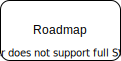

- 👋 Hi, I’m @fatsoap
* from Taiwan
- 👀 I’m interested in ... 
* backend & frontend
- 🌱 I’m currently learning ...
* Node.js , React.js
- 📫 How to reach me ...
* g8sigma@icloud.com
## 學習日誌:heart:Daily Record

:memo:  :memo:

## Learned List :memo:

## Newbie's Engineer Roadmap

Node OS React Git Html JS CSS DS
### Nodejs
- ejs, bodyparser, middleware, router, "nodemon",
- validator, Passport, process.env.XXX, "multer"
- "marked", "dompurify", "jsdom", "slugify", "method-override", "dotenv"
- connect-flash, passport custom auth callback
- jsonWebToken, nanoid,

### Git
- add, commit, push remote
- branch, checkout, merge
- gitignore, tag 

### React
- class component, function component, JSX, babel, useState, props
- lifecycle, didMount, didUpdate, willUnmount, hooks, useEffect, useRef
- Redux, Redux-thunk

### OS
### Network

SSL, DNS,
xss attack

